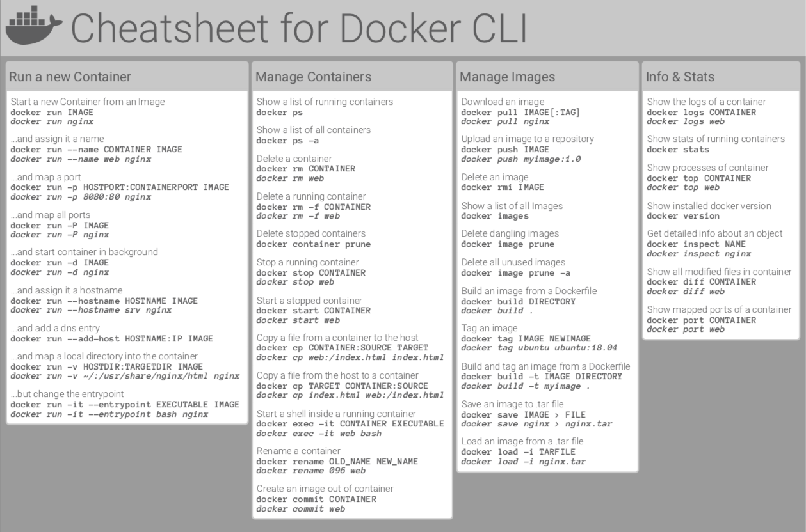

# Welcome to Docker 101 - Lab 1: Play with Docker

## Before we start

- [X] Docker Desktop installed [Mac Install](https://docs.docker.com/desktop/install/mac-install/) | [Windows Install](https://docs.docker.com/desktop/install/windows-install/)
- [X] Docker Desktop configured [Mac Desktop Setting](https://docs.docker.com/desktop/settings/mac/) | [Windows Desktop Settings](https://docs.docker.com/desktop/settings/windows/)
- [X] Docker Linux CLI [Windows Subsystem For Linux(WSL)](https://docs.docker.com/desktop/wsl/)
- [X] VS Code installed [Mac Intel](https://code.visualstudio.com/download#)/[Mac Apple Silicon](https://code.visualstudio.com/download#) | [Windows](https://code.visualstudio.com/download#) as a simple, capable editor 

### Open a shell and test your config

```bash
docker run hello-world
```

## Running a default NGINX website

### Run the container (attached)

```bash
docker run -p 8080:80 nginx
# ctrl+c to exit the container
```

## Explore: What happened?

- Pulling image
- Look at local images
- App standard output to screen

```bash 
docker image ls
```

### Run the container (detached)

```bash
docker run -d -p 8080:80 nginx
```

#### Test it from the command line

```bash
curl http://localhost:8080/index.html 
```

1) Point your browser to: http://localhost:8080/index.html
2) Open Docker Desktop

### Explore: Docker Desktop

#### Start with Containers

1) First container
2) Container names
3) Images
4) Status
5) Ports (click it)


#### Explore the Learning Center

1) Walkthroughs
2) Docker for beginners by language


#### Stop the container

```bash
docker stop {container name or id}
```

- Where can you get the container name/id?

  - Docker Desktop
  - docker command line ```bash docker container ls```

    **Pro Tip:** When referring to a docker container id, you only need specify the first 3 or 4 characters of hte id, as long as it's a unique hash.

### Look at Docker's Run docs

1) Open and bookmark the [Docker Run Reference Docs](https://docs.docker.com/engine/reference/commandline/run/)
2) Scroll down and look at all the options
3) Find and print/save Docker CLI cheat sheet like this one
   
   

#### Using the [Docker Run Reference Docs](https://docs.docker.com/engine/reference/commandline/run/) **explain the purpose** of each option in this command

```bash
docker run -d -p 8081:80 --name website -m 10MB --cpus 0.5 nginx
```

### Run the command

1) Now, run it

    ```bash
    docker run -d -p 8081:80 --name website -m 10MB --cpus 0.5 nginx
    ```

2) Test it

    ```bash
    curl http://localhost:8081/index.html 
    ```

3) Stop it

    ```bash
    docker stop website
    ```

4) Now try to run it again (spoiler alert - it fails) and talk about why it fails

    ```bash
    docker run -d -p 8081:80 --name website -m 10MB --cpus 0.5 nginx
    ```

5) **force remove** all local containers
  
    ```bash
    docker rm -f $(docker container ls -a -q) 
    ```
    **Note:** Docker command full form of ```docker container ls``` versus ```docker ps```

6) Now try again

    ```bash
    docker run -d -p 8081:80 --name website -m 10MB --cpus 0.5 nginx
    ```

7) Test it

    ```bash
    curl http://localhost:8081/index.html 
    ```

8) Review the container logs

    ```bash
    docker container logs website
    # notice the end of the logs GET response from your curl
    # curl again and check logs again
    curl http://localhost:8081/index.html 
    docker container logs website
    ```